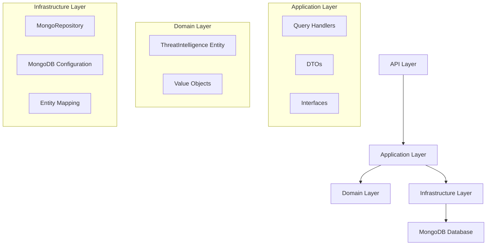

# Design Document

## Overview

This design implements a threat intelligence data querying system using MongoDB and the existing repository pattern. The solution creates a strongly-typed C# entity model that maps to the MongoDB document structure while maintaining compatibility with the existing BaseEntity architecture. The design leverages MongoDB's flexible querying capabilities through the existing MongoRepository implementation and adds specialized query methods for threat intelligence use cases.

## Architecture

The solution follows the existing Clean Architecture pattern with these layers:

- **Domain Layer**: ThreatIntelligence entity and related value objects
- **Application Layer**: Query handlers, DTOs, and specialized interfaces
- **Infrastructure Layer**: MongoDB configuration and repository extensions



## Components and Interfaces

### Domain Entities

**ThreatIntelligence Entity**

```csharp
public class ThreatIntelligence : BaseEntity
{
    public string Asn { get; set; }
    public DateTime Timestamp { get; set; }
    public string AsnInfo { get; set; }
    public OptionalInformation OptionalInformation { get; set; }
    public string Category { get; set; }
    public string SourceAddress { get; set; }
    public string SourceCountry { get; set; }
}

public class OptionalInformation
{
    public string? DestinationAddress { get; set; }
    public string? DestinationCountry { get; set; }
    public string? DestinationPort { get; set; }
    public string? SourcePort { get; set; }
    public string? Protocol { get; set; }
    public string? Family { get; set; }
}
```

### Application Interfaces

**Using Existing IRepository<T>**

The design leverages the existing `IRepository<ThreatIntelligence>` interface for all CRUD operations. Complex queries are handled through:

1. **Expression-based queries** using `FindAsync()` and `FirstOrDefaultAsync()`
2. **Paginated queries** using `GetPaginatedAsync()` with filter expressions
3. **LINQ queries** using `Query()` method for complex filtering

**Query Service Interface**

```csharp
public interface IThreatIntelligenceQueryService
{
    Task<IEnumerable<ThreatIntelligence>> GetByFilterAsync(ThreatIntelligenceFilter filter, CancellationToken ct = default);
    Task<(IEnumerable<ThreatIntelligence> Items, int TotalCount)> GetPaginatedAsync(
        ThreatIntelligenceFilter filter,
        int skip = 0,
        int take = 10,
        CancellationToken ct = default);
}
```

**Example Usage with Existing Repository**

```csharp
// Using IRepository<ThreatIntelligence> directly
var repository = serviceProvider.GetService<IRepository<ThreatIntelligence>>();

// Query by ASN
var threatsByAsn = await repository.FindAsync(t => t.Asn == "138062");

// Query by source country with pagination
var (threats, totalCount) = await repository.GetPaginatedAsync(
    predicate: t => t.SourceCountry == "ID",
    orderBy: t => t.Timestamp,
    orderByDescending: true,
    skip: 0,
    take: 20);

// Complex query using LINQ
var complexQuery = repository.Query()
    .Where(t => t.Category == "bot")
    .Where(t => t.OptionalInformation.Protocol == "TCP")
    .Where(t => t.Timestamp >= DateTime.UtcNow.AddDays(-7));
```

### Query Models

**ThreatIntelligenceFilter**

```csharp
public class ThreatIntelligenceFilter
{
    public string? Asn { get; set; }
    public string? SourceAddress { get; set; }
    public string? DestinationAddress { get; set; }
    public string? SourceCountry { get; set; }
    public string? DestinationCountry { get; set; }
    public string? Category { get; set; }
    public string? Protocol { get; set; }
    public string? SourcePort { get; set; }
    public string? DestinationPort { get; set; }
    public string? MalwareFamily { get; set; }
    public DateTime? StartDate { get; set; }
    public DateTime? EndDate { get; set; }
    public string? SortBy { get; set; }
    public bool SortDescending { get; set; } = true;
}
```

## Data Models

### MongoDB Document Mapping

The MongoDB document structure maps to C# entities as follows:

| MongoDB Field          | C# Property           | Type                  | Notes                       |
| ---------------------- | --------------------- | --------------------- | --------------------------- |
| `_id`                  | `Id`                  | `Guid`                | Converted from ObjectId     |
| `asn`                  | `Asn`                 | `string`              | Direct mapping              |
| `timestamp`            | `Timestamp`           | `DateTime`            | Converted from MongoDB date |
| `asninfo`              | `AsnInfo`             | `string`              | Direct mapping              |
| `optional_information` | `OptionalInformation` | `OptionalInformation` | Nested object               |
| `category`             | `Category`            | `string`              | Direct mapping              |
| `source_address`       | `SourceAddress`       | `string`              | Direct mapping              |
| `source_country`       | `SourceCountry`       | `string`              | Direct mapping              |

### MongoDB Configuration

**Entity Configuration**

```csharp
public class ThreatIntelligenceConfiguration : IEntityTypeConfiguration<ThreatIntelligence>
{
    public void Configure(EntityTypeBuilder<ThreatIntelligence> builder)
    {
        // Configure MongoDB-specific mappings
        builder.Property(e => e.Id)
            .HasConversion(
                v => v.ToString(),
                v => Guid.Parse(v));

        builder.OwnsOne(e => e.OptionalInformation);
    }
}
```

## Error Handling

### Exception Types

1. **ThreatIntelligenceNotFoundException**: When querying for non-existent threat data
2. **InvalidFilterException**: When filter parameters are invalid
3. **MongoConnectionException**: When MongoDB connection fails
4. **DataMappingException**: When document mapping fails

### Error Handling Strategy

```csharp
public class ThreatIntelligenceQueryHandler
{
    public async Task<Result<IEnumerable<ThreatIntelligence>>> Handle(Query request)
    {
        try
        {
            // Query logic
            return Result.Success(data);
        }
        catch (MongoException ex)
        {
            return Result.Failure($"Database error: {ex.Message}");
        }
        catch (ArgumentException ex)
        {
            return Result.Failure($"Invalid parameters: {ex.Message}");
        }
    }
}
```

## Testing Strategy

### Unit Tests

1. **Entity Mapping Tests**

   - Test MongoDB document to C# entity conversion
   - Test complex nested object mapping
   - Test date/time conversion accuracy

2. **Repository Tests**

   - Test all query methods with various parameters
   - Test pagination functionality
   - Test filtering combinations
   - Test soft delete behavior

3. **Query Handler Tests**
   - Test business logic validation
   - Test error handling scenarios
   - Test result transformation

### Integration Tests

1. **MongoDB Integration**

   - Test actual database operations
   - Test connection handling
   - Test transaction behavior

2. **End-to-End Tests**
   - Test complete query workflows
   - Test API endpoints
   - Test performance with large datasets

### Test Data Strategy

```csharp
public class ThreatIntelligenceTestDataBuilder
{
    public static ThreatIntelligence CreateSample()
    {
        return new ThreatIntelligence
        {
            Asn = "138062",
            Timestamp = DateTime.UtcNow,
            AsnInfo = "IDNIC-PAAS-AS-ID PT. Awan Kilat Semesta, ID",
            Category = "bot",
            SourceAddress = "103.129.222.46",
            SourceCountry = "ID",
            OptionalInformation = new OptionalInformation
            {
                DestinationAddress = "137.175.90.212",
                DestinationCountry = "US",
                DestinationPort = "80",
                SourcePort = "59436",
                Protocol = "TCP",
                Family = "xorddos"
            }
        };
    }
}
```

## Performance Considerations

### Indexing Strategy

```javascript
// MongoDB indexes for optimal query performance
db.ThreatIntelligence.createIndex({ asn: 1 });
db.ThreatIntelligence.createIndex({ source_address: 1 });
db.ThreatIntelligence.createIndex({ timestamp: -1 });
db.ThreatIntelligence.createIndex({ category: 1 });
db.ThreatIntelligence.createIndex({ source_country: 1, timestamp: -1 });
db.ThreatIntelligence.createIndex({ "optional_information.protocol": 1 });
```

### Query Optimization

1. **Compound Indexes**: Create indexes for common filter combinations
2. **Projection**: Only select required fields for large result sets
3. **Aggregation Pipeline**: Use MongoDB aggregation for complex queries
4. **Connection Pooling**: Configure appropriate connection pool settings

### Caching Strategy

```csharp
public class ThreatIntelligenceQueryService : IThreatIntelligenceQueryService
{
    private readonly IRepository<ThreatIntelligence> _repository;
    private readonly IMemoryCache _cache;

    public ThreatIntelligenceQueryService(IRepository<ThreatIntelligence> repository, IMemoryCache cache)
    {
        _repository = repository;
        _cache = cache;
    }

    public async Task<IEnumerable<ThreatIntelligence>> GetByFilterAsync(ThreatIntelligenceFilter filter, CancellationToken ct = default)
    {
        var cacheKey = $"threats_{filter.GetHashCode()}";
        if (_cache.TryGetValue(cacheKey, out var cached))
            return (IEnumerable<ThreatIntelligence>)cached;

        // Build expression based on filter
        var threats = await _repository.FindAsync(BuildFilterExpression(filter), ct);
        _cache.Set(cacheKey, threats, TimeSpan.FromMinutes(5));
        return threats;
    }

    private Expression<Func<ThreatIntelligence, bool>> BuildFilterExpression(ThreatIntelligenceFilter filter)
    {
        // Implementation to build LINQ expression from filter
        return t => (string.IsNullOrEmpty(filter.Category) || t.Category == filter.Category) &&
                   (string.IsNullOrEmpty(filter.SourceCountry) || t.SourceCountry == filter.SourceCountry);
    }
}
```
