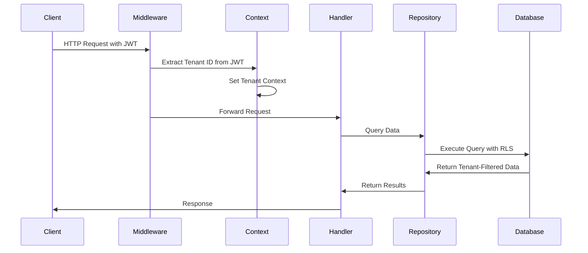
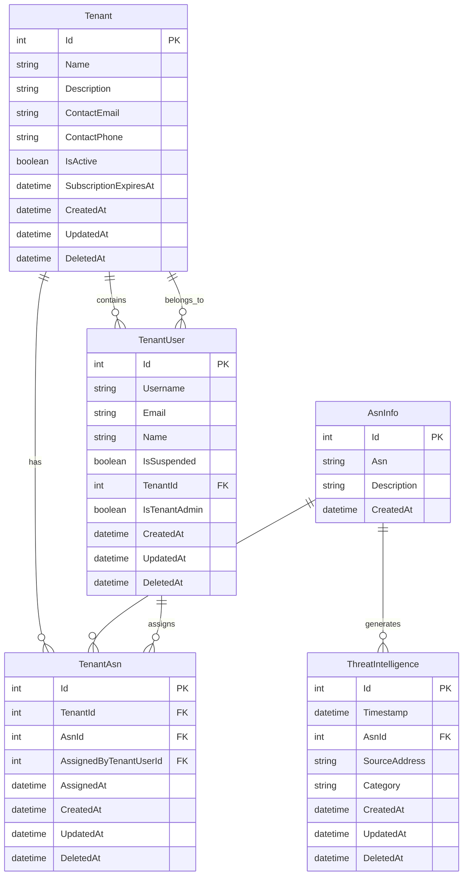

# Multi-Tenant Architecture Design

## Overview

This design implements a comprehensive multi-tenant architecture for the threat intelligence application using a dedicated tenant entity approach. The system will provide complete data isolation between tenants while maintaining high performance and scalability. The architecture follows the "tenant-per-schema" pattern with row-level security (RLS) for optimal data isolation and query performance.

Key design principles:

- **Data Isolation**: Complete separation of tenant data using PostgreSQL Row Level Security
- **Transparent Integration**: Minimal impact on existing application code through automatic tenant context injection
- **Scalable Architecture**: Support for thousands of tenants with efficient query performance
- **Flexible ASN Assignment**: Many-to-many relationship between tenants and ASNs for organizational flexibility
- **Administrative Control**: Clear separation between super admin, tenant admin, and tenant user roles

## Architecture

### Tenant Context Flow



## Components and Interfaces

### 1. Domain Entities

#### Tenant Entity

```csharp
public class Tenant : BaseEntity
{
    public string Name { get; set; } = string.Empty;
    public string Description { get; set; } = string.Empty;
    public string ContactEmail { get; set; } = string.Empty;
    public string ContactPhone { get; set; } = string.Empty;
    public bool IsActive { get; set; } = true;
    public DateTime? SubscriptionExpiresAt { get; set; }

    // Navigation properties
    public virtual ICollection<TenantAsn> TenantAsns { get; set; } = new List<TenantAsn>();
    public virtual ICollection<TenantUser> TenantUsers { get; set; } = new List<TenantUser>();
}
```

#### TenantAsn Entity (Junction Table)

```csharp
public class TenantAsn : BaseEntity
{
    public int TenantId { get; set; }
    public int AsnId { get; set; }
    public DateTime AssignedAt { get; set; } = DateTime.UtcNow;
    public int? AssignedByTenantUserId { get; set; } // References super admin TenantUser who assigned

    // Navigation properties
    public virtual Tenant Tenant { get; set; } = null!;
    public virtual AsnInfo AsnInfo { get; set; } = null!;
    public virtual TenantUser? AssignedByTenantUser { get; set; } // Super admin TenantUser who assigned
}
```

#### TenantUser Entity (Separate from main User table)

```csharp
public class TenantUser : BaseEntity
{
    public string Username { get; set; } = string.Empty;
    public string Email { get; set; } = string.Empty;
    public string Name { get; set; } = string.Empty;
    public bool IsSuspended { get; set; } = false;
    public int TenantId { get; set; }
    public bool IsTenantAdmin { get; set; } = false;

    // Navigation properties
    public virtual Tenant Tenant { get; set; } = null!;
    public ICollection<TenantUserLoginMethod> TenantUserLoginMethods { get; set; } = [];
    public ICollection<TenantUserRefreshToken> TenantUserRefreshTokens { get; set; } = [];
    public ICollection<TenantUserRole> TenantUserRoles { get; set; } = [];
}
```

### 2. Tenant Context Service

#### ITenantContext Interface

```csharp
public interface ITenantContext
{
    int? TenantId { get; }
    string? TenantName { get; }
    bool IsSuperAdmin { get; }
    bool HasTenantAccess(int tenantId);
    void SetTenantContext(int? tenantId, string? tenantName, bool isSuperAdmin);
    void ClearContext();
}
```

#### TenantContext Implementation

```csharp
public class TenantContext : ITenantContext
{
    private readonly IHttpContextAccessor _httpContextAccessor;

    public int? TenantId => GetClaimValue<int?>("tenant_id");
    public string? TenantName => GetClaimValue<string>("tenant_name");
    public bool IsSuperAdmin => GetClaimValue<bool>("is_super_admin");

    public bool HasTenantAccess(int tenantId)
    {
        return IsSuperAdmin || TenantId == tenantId;
    }

    // Implementation details...
}
```

### 3. Tenant Middleware

```csharp
public class TenantMiddleware
{
    private readonly RequestDelegate _next;
    private readonly ITenantContext _tenantContext;

    public async Task InvokeAsync(HttpContext context)
    {
        var token = ExtractJwtToken(context);
        if (token != null)
        {
            var claims = DecodeJwtClaims(token);
            _tenantContext.SetTenantContext(
                claims.TenantId,
                claims.TenantName,
                claims.IsSuperAdmin
            );
        }

        await _next(context);
    }
}
```

### 4. Repository Pattern Updates

#### ITenantRepository Interface

```csharp
public interface ITenantRepository : IRepository<Tenant>
{
    Task<Tenant?> GetByNameAsync(string name, CancellationToken ct = default);
    Task<IEnumerable<Tenant>> GetActiveTenantsAsync(CancellationToken ct = default);
    Task<IEnumerable<AsnInfo>> GetTenantAsnsAsync(int tenantId, CancellationToken ct = default);
    Task AssignAsnToTenantAsync(int tenantId, int asnId, int assignedByTenantUserId, CancellationToken ct = default);
    Task RemoveAsnFromTenantAsync(int tenantId, int asnId, CancellationToken ct = default);
    Task<bool> IsAsnAssignedAsync(int asnId, CancellationToken ct = default);
}
```

#### Updated IThreatIntelligenceRepository

```csharp
public interface IThreatIntelligenceRepository : IRepository<ThreatIntelligence>
{
    // All existing methods remain the same
    // Tenant filtering will be handled automatically by RLS

    // New tenant-specific methods
    Task<IEnumerable<int>> GetTenantAsnIdsAsync(int tenantId, CancellationToken ct = default);
    Task<long> GetTenantThreatCountAsync(int tenantId, DateTime startTime, DateTime endTime, CancellationToken ct = default);
}
```

### 5. Database Schema Updates

#### Row Level Security Policies

```sql
-- Enable RLS on threat_intelligences table
ALTER TABLE threat_intelligences ENABLE ROW LEVEL SECURITY;

-- Policy for super admins (can see all data)
CREATE POLICY threat_intelligence_super_admin_policy ON threat_intelligences
    FOR ALL
    TO application_role
    USING (current_setting('app.is_super_admin', true)::boolean = true);

-- Policy for tenant users (can only see their tenant's ASN data)
CREATE POLICY threat_intelligence_tenant_policy ON threat_intelligences
    FOR ALL
    TO application_role
    USING (
        asn_id IN (
            SELECT ta.asn_id
            FROM tenant_asns ta
            WHERE ta.tenant_id = current_setting('app.tenant_id', true)::integer
            AND ta.deleted_at IS NULL
        )
    );

-- Similar policies for other tenant-sensitive tables
```

#### Database Functions for Context Setting

```sql
-- Function to set tenant context
CREATE OR REPLACE FUNCTION set_tenant_context(
    p_tenant_id INTEGER DEFAULT NULL,
    p_is_super_admin BOOLEAN DEFAULT FALSE
)
RETURNS VOID AS $$
BEGIN
    PERFORM set_config('app.tenant_id', COALESCE(p_tenant_id::text, ''), false);
    PERFORM set_config('app.is_super_admin', p_is_super_admin::text, false);
END;
$$ LANGUAGE plpgsql;
```

## Data Models

### Entity Relationship Diagram



### Tenant Data Access Patterns

1. **Super Admin Access**: Full access to all tenants and data
2. **Tenant Admin Access**: Full access to their tenant's data and user management
3. **Tenant User Access**: Read-only access to their tenant's threat intelligence data
4. **ASN Assignment**: Many-to-many relationship allowing flexible ASN distribution

## Error Handling

### Tenant-Specific Error Types

```csharp
public class TenantNotFoundException : NotFoundException
{
    public TenantNotFoundException(int tenantId)
        : base($"Tenant with ID {tenantId} was not found") { }
}

public class TenantAccessDeniedException : ForbiddenException
{
    public TenantAccessDeniedException(int tenantId)
        : base($"Access denied to tenant {tenantId}") { }
}

public class AsnAlreadyAssignedException : ConflictException
{
    public AsnAlreadyAssignedException(string asn, int tenantId)
        : base($"ASN {asn} is already assigned to tenant {tenantId}") { }
}
```

### Error Handling Strategy

1. **Tenant Context Validation**: Middleware validates tenant context on every request
2. **ASN Assignment Conflicts**: Prevent duplicate ASN assignments with database constraints
3. **Data Access Violations**: RLS policies automatically prevent unauthorized data access
4. **Tenant Deletion Protection**: Prevent tenant deletion if ASNs are still assigned

## Testing Strategy

### Unit Testing Approach

1. **Tenant Context Testing**: Mock ITenantContext for isolated unit tests
2. **Repository Testing**: Test tenant filtering logic with in-memory database
3. **Middleware Testing**: Verify JWT token parsing and context setting
4. **RLS Policy Testing**: Database-level tests for row-level security policies

### Integration Testing Strategy

1. **Multi-Tenant Data Isolation**: Verify complete data separation between tenants
2. **ASN Assignment Workflows**: Test end-to-end ASN assignment and removal
3. **User Management**: Test tenant-scoped user creation and role assignment
4. **Performance Testing**: Ensure RLS policies don't significantly impact query performance

### Test Data Setup

```csharp
public class MultiTenantTestFixture
{
    public Tenant TenantA { get; set; }
    public Tenant TenantB { get; set; }
    public TenantUser SuperAdmin { get; set; }
    public TenantUser TenantAAdmin { get; set; }
    public TenantUser TenantBUser { get; set; }
    public AsnInfo Asn1 { get; set; }
    public AsnInfo Asn2 { get; set; }

    // Setup methods for creating test scenarios
}
```

### Performance Considerations

1. **RLS Policy Optimization**: Ensure policies use efficient indexes
2. **Tenant Context Caching**: Cache tenant information to reduce database calls
3. **ASN Assignment Indexing**: Optimize queries for tenant ASN lookups
4. **TimescaleDB Compatibility**: Ensure RLS works efficiently with time-series data

This design provides a robust, scalable multi-tenant architecture that maintains data isolation while preserving the existing application functionality and performance characteristics.
