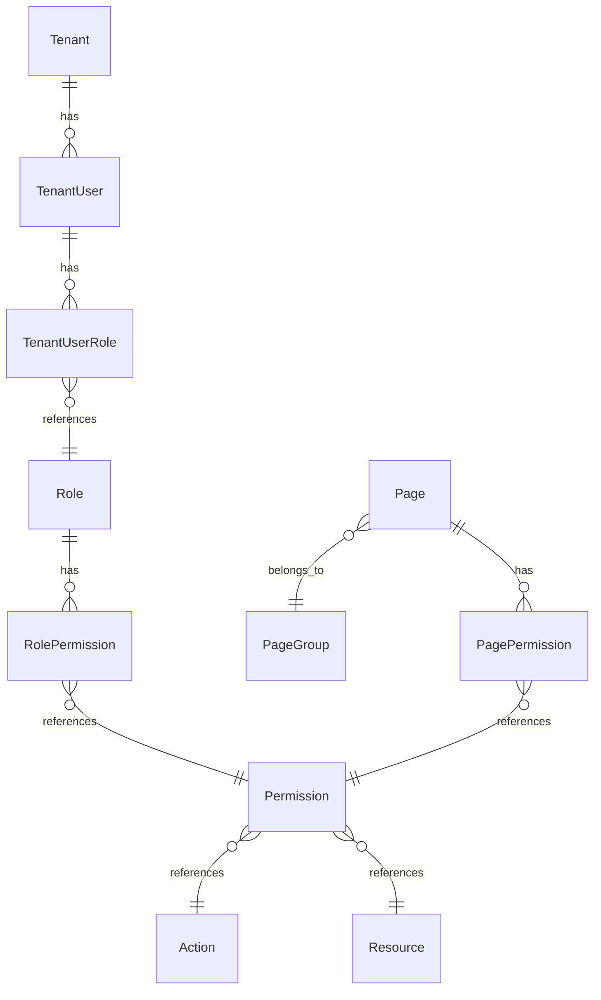

# Design Document

## Overview

This design document outlines the implementation of tenant-aware permission endpoints that provide CRUD operations for permissions, actions, resources, pages, and page groups within the tenant context. The design follows the existing patterns established in the current tenant architecture while ensuring proper isolation and security.

## Architecture

### High-Level Architecture

The tenant permission endpoints will follow the existing Clean Architecture pattern:

```
API Layer (Endpoints) → Application Layer (Queries/Commands) → Infrastructure Layer (Repositories) → Database
```

### Tenant Context Integration

All endpoints will integrate with the existing tenant context system:

- Use `ITenantContext` for tenant isolation
- Implement `ITenantPermissionProvider` for authorization
- Follow tenant-aware URL patterns (`/api/v1/tenant/...`)

## Components and Interfaces

### 1. API Endpoints

#### Endpoint Structure

All tenant permission endpoints will be organized under `/api/v1/tenant/` prefix:

```
GET /api/v1/tenant/permissions
GET /api/v1/tenant/actions
GET /api/v1/tenant/resources
GET /api/v1/tenant/pages
GET /api/v1/tenant/page-groups
GET /api/v1/tenant/users/{userId}/accessible-pages
GET /api/v1/tenant/users/{userId}/permissions
```

#### Base Endpoint Classes

Endpoints will inherit from existing base classes:

- `BaseEndpointWithoutRequest<TResponse>` for GET operations
- `BaseEndpoint<TRequest, TResponse>` for operations with parameters

#### Permission Requirements

Each endpoint will implement `ITenantPermissionProvider` with appropriate permissions:

```csharp
public class GetTenantPermissionsEndpoint : BaseEndpointWithoutRequest<IEnumerable<PermissionDto>>, ITenantPermissionProvider
{
    public static string Permission => "READ:TENANT_PERMISSION";
    // Implementation
}
```

### 2. Application Layer Queries

#### Query Structure

Each endpoint will have a corresponding query in the Application layer:

```csharp
// Queries for basic CRUD operations
public record GetTenantPermissionsQuery : IRequest<IEnumerable<PermissionDto>>;
public record GetTenantActionsQuery : IRequest<IEnumerable<ActionDto>>;
public record GetTenantResourcesQuery : IRequest<IEnumerable<ResourceDto>>;
public record GetTenantPagesQuery : IRequest<IEnumerable<PageDto>>;
public record GetTenantPageGroupsQuery : IRequest<IEnumerable<PageGroupDto>>;

// Queries for user-specific operations
public record GetTenantUserAccessiblePagesQuery(Guid UserId) : IRequest<IEnumerable<PageDto>>;
public record GetTenantUserPermissionsQuery(Guid UserId) : IRequest<IEnumerable<PermissionDto>>;
```

#### Query Handlers

Query handlers will use `ITenantContext` for tenant isolation:

```csharp
public class GetTenantPermissionsQueryHandler : IRequestHandler<GetTenantPermissionsQuery, IEnumerable<PermissionDto>>
{
    private readonly IRepository<Permission> _permissionRepository;
    private readonly ITenantContext _tenantContext;
    private readonly IMapper _mapper;

    public async Task<IEnumerable<PermissionDto>> Handle(GetTenantPermissionsQuery request, CancellationToken cancellationToken)
    {
        var tenantId = _tenantContext.TenantId;
        // Implementation with tenant filtering
    }
}
```

### 3. Data Models and DTOs

#### Existing DTOs Enhancement

Leverage existing DTOs from the Authorization feature:

- `PermissionDto`
- `ActionDto`
- `ResourceDto`
- `PageDto`
- `PageGroupDto`

#### Tenant-Aware Filtering

DTOs will include tenant context information where relevant:

```csharp
public class TenantPermissionDto : PermissionDto
{
    public Guid TenantId { get; set; }
    public bool IsAccessible { get; set; }
}
```

### 4. Repository Layer

#### Tenant-Aware Queries

Repository methods will include tenant filtering:

```csharp
public interface ITenantAuthorizationRepository
{
    Task<IEnumerable<Permission>> GetTenantPermissionsAsync(Guid tenantId, CancellationToken cancellationToken);
    Task<IEnumerable<Action>> GetTenantActionsAsync(Guid tenantId, CancellationToken cancellationToken);
    Task<IEnumerable<Resource>> GetTenantResourcesAsync(Guid tenantId, CancellationToken cancellationToken);
    Task<IEnumerable<Page>> GetTenantPagesAsync(Guid tenantId, CancellationToken cancellationToken);
    Task<IEnumerable<PageGroup>> GetTenantPageGroupsAsync(Guid tenantId, CancellationToken cancellationToken);
    Task<IEnumerable<Page>> GetTenantUserAccessiblePagesAsync(Guid tenantId, Guid userId, CancellationToken cancellationToken);
    Task<IEnumerable<Permission>> GetTenantUserPermissionsAsync(Guid tenantId, Guid userId, CancellationToken cancellationToken);
}
```

## Data Models

### Database Schema Considerations

#### Tenant Isolation Strategy

The design will use the existing tenant isolation approach:

1. **Tenant-Specific Data**: Some entities may need tenant-specific instances
2. **Global Data with Access Control**: Some entities remain global but access is controlled by tenant permissions
3. **Hybrid Approach**: Combination of both strategies based on entity type

#### Entity Relationships



### Tenant Permission Scope

#### Permission Categories

1. **Tenant-Scoped Permissions**: Permissions that are specific to tenant operations
2. **Global Permissions**: System-wide permissions that may be accessible to tenants
3. **Inherited Permissions**: Permissions inherited through roles and hierarchies

#### Access Control Matrix

| Entity Type | Tenant Isolation             | Access Pattern                        |
| ----------- | ---------------------------- | ------------------------------------- |
| Permissions | Filtered by tenant context   | Show only tenant-relevant permissions |
| Actions     | Global with tenant filtering | Show actions available to tenant      |
| Resources   | Global with tenant filtering | Show resources accessible to tenant   |
| Pages       | Tenant-aware filtering       | Show pages accessible within tenant   |
| Page Groups | Tenant-aware filtering       | Show page groups relevant to tenant   |

## Error Handling

### Error Types

1. **Tenant Context Errors**

   - `TenantNotFoundException`: When tenant context is missing
   - `TenantAccessDeniedException`: When user lacks tenant access

2. **Authorization Errors**

   - `UnauthorizedException`: When user is not authenticated
   - `ForbiddenException`: When user lacks required permissions

3. **Validation Errors**
   - `NotFoundException`: When requested entity doesn't exist
   - `ValidationException`: When request parameters are invalid

### Error Response Format

Follow existing error response patterns:

```csharp
{
    "success": false,
    "message": "Error description",
    "errors": ["Detailed error messages"],
    "data": null
}
```

## Testing Strategy

### Unit Testing

1. **Endpoint Tests**: Test endpoint behavior, authorization, and response formatting
2. **Query Handler Tests**: Test business logic and tenant isolation
3. **Repository Tests**: Test data access and tenant filtering

### Integration Testing

1. **End-to-End Tests**: Test complete request flow with tenant context
2. **Authorization Tests**: Verify permission checking and tenant isolation
3. **Database Tests**: Verify tenant data isolation and query performance

### Test Data Strategy

1. **Multi-Tenant Test Data**: Create test scenarios with multiple tenants
2. **Permission Scenarios**: Test various permission combinations
3. **Edge Cases**: Test boundary conditions and error scenarios

## Security Considerations

### Tenant Isolation

1. **Data Isolation**: Ensure queries filter by tenant context
2. **Cross-Tenant Prevention**: Prevent access to other tenant's data
3. **Context Validation**: Validate tenant context on every request

### Permission Validation

1. **Endpoint Authorization**: Check permissions before processing requests
2. **Resource-Level Security**: Validate access to specific resources
3. **Audit Logging**: Log permission-related operations for security auditing

### Input Validation

1. **Parameter Validation**: Validate all input parameters
2. **SQL Injection Prevention**: Use parameterized queries
3. **XSS Prevention**: Sanitize output data

## Performance Considerations

### Database Optimization

1. **Indexing Strategy**: Create indexes on tenant_id and frequently queried fields
2. **Query Optimization**: Use efficient joins and filtering
3. **Connection Pooling**: Leverage existing connection pooling

### Caching Strategy

1. **Permission Caching**: Cache frequently accessed permissions
2. **Tenant Data Caching**: Cache tenant-specific configuration
3. **Cache Invalidation**: Implement proper cache invalidation strategies

### Pagination

1. **Large Dataset Handling**: Implement pagination for large result sets
2. **Configurable Page Sizes**: Allow configurable page sizes
3. **Efficient Counting**: Use efficient count queries for pagination

## API Documentation

### OpenAPI Specification

All endpoints will be documented with:

1. **Request/Response Schemas**: Complete schema definitions
2. **Authentication Requirements**: Document required permissions
3. **Error Responses**: Document possible error scenarios
4. **Examples**: Provide request/response examples

### Endpoint Documentation Template

```yaml
/api/v1/tenant/permissions:
  get:
    tags:
      - Tenant Permissions
    summary: Get tenant permissions
    description: Retrieves all permissions available within the tenant context
    security:
      - BearerAuth: []
    responses:
      200:
        description: Permissions retrieved successfully
        content:
          application/json:
            schema:
              $ref: "#/components/schemas/PermissionListResponse"
      401:
        $ref: "#/components/responses/Unauthorized"
      403:
        $ref: "#/components/responses/Forbidden"
      404:
        $ref: "#/components/responses/TenantNotFound"
```

## Migration and Deployment

### Database Migrations

1. **Schema Updates**: Add any required indexes or constraints
2. **Data Migration**: Migrate existing data if needed
3. **Rollback Strategy**: Plan for rollback scenarios

### Feature Flags

1. **Gradual Rollout**: Use feature flags for gradual deployment
2. **A/B Testing**: Enable A/B testing of new endpoints
3. **Rollback Capability**: Quick rollback if issues arise

### Monitoring and Observability

1. **Metrics Collection**: Track endpoint usage and performance
2. **Error Monitoring**: Monitor error rates and types
3. **Performance Monitoring**: Track response times and database performance
