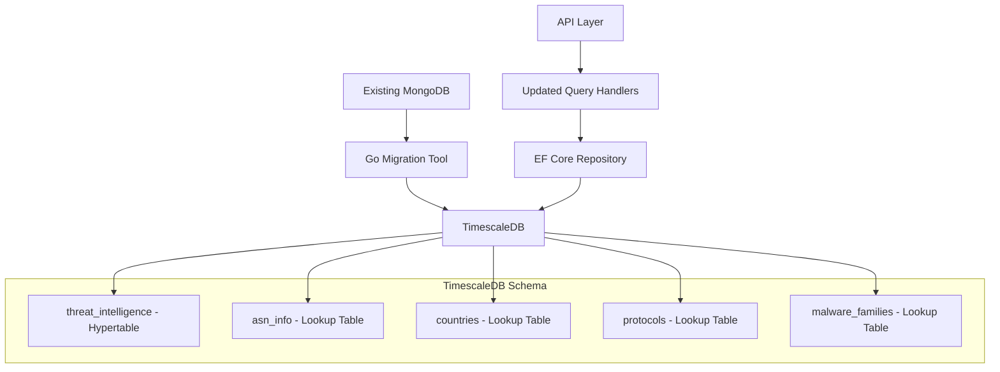

# Design Document

## Overview

This design migrates threat intelligence data from MongoDB to TimescaleDB to achieve significant performance improvements for time-series queries. The solution implements a normalized relational schema optimized for TimescaleDB's hypertable capabilities, uses EF Core for strongly-typed data access, and includes a Go-based migration tool for data transfer. The design maintains API compatibility while leveraging TimescaleDB's advanced time-series features like continuous aggregates and compression.

## Architecture

The migration follows a multi-phase approach with these key components:

- **TimescaleDB Schema**: Normalized tables with hypertables for time-series optimization
- **EF Core Integration**: Updated entities and configurations for PostgreSQL/TimescaleDB
- **Migration Tool**: Go application for efficient data transfer from MongoDB
- **API Compatibility Layer**: Updated query handlers maintaining existing contracts



## Components and Interfaces

### TimescaleDB Schema Design

**Main Hypertable: threat_intelligence**

```sql
CREATE TABLE threat_intelligence (
    id UUID PRIMARY KEY DEFAULT gen_random_uuid(),
    timestamp TIMESTAMPTZ NOT NULL,
    asn_id INTEGER NOT NULL REFERENCES asn_info(id),
    source_address INET NOT NULL,
    source_country_id INTEGER REFERENCES countries(id),
    destination_address INET,
    destination_country_id INTEGER REFERENCES countries(id),
    source_port INTEGER,
    destination_port INTEGER,
    protocol_id INTEGER REFERENCES protocols(id),
    category VARCHAR(50) NOT NULL,
    malware_family_id INTEGER REFERENCES malware_families(id),
    created_at TIMESTAMPTZ DEFAULT NOW(),
    updated_at TIMESTAMPTZ DEFAULT NOW(),
    deleted_at TIMESTAMPTZ
);

-- Convert to hypertable partitioned by timestamp
SELECT create_hypertable('threat_intelligence', 'timestamp', chunk_time_interval => INTERVAL '1 day');
```

**Lookup Tables for Normalization**

```sql
-- ASN Information
CREATE TABLE asn_info (
    id SERIAL PRIMARY KEY,
    asn VARCHAR(20) UNIQUE NOT NULL,
    description TEXT,
    created_at TIMESTAMPTZ DEFAULT NOW()
);

-- Countries
CREATE TABLE countries (
    id SERIAL PRIMARY KEY,
    code CHAR(2) UNIQUE NOT NULL,
    name VARCHAR(100) NOT NULL,
    created_at TIMESTAMPTZ DEFAULT NOW()
);

-- Protocols
CREATE TABLE protocols (
    id SERIAL PRIMARY KEY,
    name VARCHAR(20) UNIQUE NOT NULL,
    created_at TIMESTAMPTZ DEFAULT NOW()
);

-- Malware Families
CREATE TABLE malware_families (
    id SERIAL PRIMARY KEY,
    name VARCHAR(100) UNIQUE NOT NULL,
    created_at TIMESTAMPTZ DEFAULT NOW()
);
```

**Indexes for Optimal Performance**

```sql
-- Time-series optimized indexes
CREATE INDEX idx_threat_timestamp_source ON threat_intelligence (timestamp DESC, source_address);
CREATE INDEX idx_threat_timestamp_asn ON threat_intelligence (timestamp DESC, asn_id);
CREATE INDEX idx_threat_source_addr ON threat_intelligence USING hash (source_address);
CREATE INDEX idx_threat_dest_addr ON threat_intelligence USING hash (destination_address);
CREATE INDEX idx_threat_category ON threat_intelligence (category, timestamp DESC);
CREATE INDEX idx_threat_country_time ON threat_intelligence (source_country_id, timestamp DESC);

-- Composite indexes for common query patterns
CREATE INDEX idx_threat_asn_category_time ON threat_intelligence (asn_id, category, timestamp DESC);
CREATE INDEX idx_threat_country_protocol_time ON threat_intelligence (source_country_id, protocol_id, timestamp DESC);
```

### Updated EF Core Entities

**ThreatIntelligence Entity**

```csharp
public class ThreatIntelligence : BaseEntity
{
    public DateTime Timestamp { get; set; }
    public int AsnId { get; set; }
    public IPAddress SourceAddress { get; set; } = IPAddress.None;
    public int? SourceCountryId { get; set; }
    public IPAddress? DestinationAddress { get; set; }
    public int? DestinationCountryId { get; set; }
    public int? SourcePort { get; set; }
    public int? DestinationPort { get; set; }
    public int? ProtocolId { get; set; }
    public string Category { get; set; } = string.Empty;
    public int? MalwareFamilyId { get; set; }

    // Navigation properties
    public virtual AsnInfo AsnInfo { get; set; } = null!;
    public virtual Country? SourceCountry { get; set; }
    public virtual Country? DestinationCountry { get; set; }
    public virtual Protocol? Protocol { get; set; }
    public virtual MalwareFamily? MalwareFamily { get; set; }
}
```

**Lookup Entities**

```csharp
public class AsnInfo
{
    public int Id { get; set; }
    public string Asn { get; set; } = string.Empty;
    public string Description { get; set; } = string.Empty;
    public DateTime CreatedAt { get; set; }

    public virtual ICollection<ThreatIntelligence> ThreatIntelligences { get; set; } = new List<ThreatIntelligence>();
}

public class Country
{
    public int Id { get; set; }
    public string Code { get; set; } = string.Empty;
    public string Name { get; set; } = string.Empty;
    public DateTime CreatedAt { get; set; }

    public virtual ICollection<ThreatIntelligence> SourceThreats { get; set; } = new List<ThreatIntelligence>();
    public virtual ICollection<ThreatIntelligence> DestinationThreats { get; set; } = new List<ThreatIntelligence>();
}

public class Protocol
{
    public int Id { get; set; }
    public string Name { get; set; } = string.Empty;
    public DateTime CreatedAt { get; set; }

    public virtual ICollection<ThreatIntelligence> ThreatIntelligences { get; set; } = new List<ThreatIntelligence>();
}

public class MalwareFamily
{
    public int Id { get; set; }
    public string Name { get; set; } = string.Empty;
    public DateTime CreatedAt { get; set; }

    public virtual ICollection<ThreatIntelligence> ThreatIntelligences { get; set; } = new List<ThreatIntelligence>();
}
```

### EF Core Configuration

**ThreatIntelligence Configuration**

```csharp
public class ThreatIntelligenceConfiguration : IEntityTypeConfiguration<ThreatIntelligence>
{
    public void Configure(EntityTypeBuilder<ThreatIntelligence> builder)
    {
        builder.ToTable("threat_intelligence");

        builder.HasKey(e => e.Id);
        builder.Property(e => e.Id).HasColumnName("id");

        builder.Property(e => e.Timestamp)
            .HasColumnName("timestamp")
            .HasColumnType("timestamptz")
            .IsRequired();

        builder.Property(e => e.SourceAddress)
            .HasColumnName("source_address")
            .HasColumnType("inet")
            .IsRequired();

        builder.Property(e => e.DestinationAddress)
            .HasColumnName("destination_address")
            .HasColumnType("inet");

        builder.Property(e => e.Category)
            .HasColumnName("category")
            .HasMaxLength(50)
            .IsRequired();

        // Foreign key relationships
        builder.HasOne(e => e.AsnInfo)
            .WithMany(a => a.ThreatIntelligences)
            .HasForeignKey(e => e.AsnId)
            .HasConstraintName("fk_threat_asn");

        builder.HasOne(e => e.SourceCountry)
            .WithMany(c => c.SourceThreats)
            .HasForeignKey(e => e.SourceCountryId)
            .HasConstraintName("fk_threat_source_country");

        builder.HasOne(e => e.DestinationCountry)
            .WithMany(c => c.DestinationThreats)
            .HasForeignKey(e => e.DestinationCountryId)
            .HasConstraintName("fk_threat_dest_country");

        builder.HasOne(e => e.Protocol)
            .WithMany(p => p.ThreatIntelligences)
            .HasForeignKey(e => e.ProtocolId)
            .HasConstraintName("fk_threat_protocol");

        builder.HasOne(e => e.MalwareFamily)
            .WithMany(m => m.ThreatIntelligences)
            .HasForeignKey(e => e.MalwareFamilyId)
            .HasConstraintName("fk_threat_malware_family");

        // Indexes
        builder.HasIndex(e => new { e.Timestamp, e.SourceAddress })
            .HasDatabaseName("idx_threat_timestamp_source");

        builder.HasIndex(e => e.SourceAddress)
            .HasDatabaseName("idx_threat_source_addr")
            .HasMethod("hash");
    }
}
```

### Go Migration Tool Architecture

**Main Migration Structure**

```go
package main

type MigrationTool struct {
    mongoClient     *mongo.Client
    postgresDB      *sql.DB
    batchSize       int
    workerCount     int
    progressTracker *ProgressTracker
}

type ThreatDocument struct {
    ID                   primitive.ObjectID `bson:"_id"`
    ASN                  string            `bson:"asn"`
    Timestamp            time.Time         `bson:"timestamp"`
    ASNInfo              string            `bson:"asninfo"`
    OptionalInformation  OptionalInfo      `bson:"optional_information"`
    Category             string            `bson:"category"`
    SourceAddress        string            `bson:"source_address"`
    SourceCountry        string            `bson:"source_country"`
}

type OptionalInfo struct {
    DestinationAddress string `bson:"destination_address,omitempty"`
    DestinationCountry string `bson:"destination_country,omitempty"`
    DestinationPort    string `bson:"destination_port,omitempty"`
    SourcePort         string `bson:"source_port,omitempty"`
    Protocol           string `bson:"protocol,omitempty"`
    Family             string `bson:"family,omitempty"`
}
```

**Migration Process Flow**

```go
func (m *MigrationTool) Migrate() error {
    // 1. Initialize lookup tables
    if err := m.initializeLookupTables(); err != nil {
        return err
    }

    // 2. Create worker pool for parallel processing
    jobs := make(chan []ThreatDocument, 100)
    results := make(chan MigrationResult, 100)

    // Start workers
    for i := 0; i < m.workerCount; i++ {
        go m.worker(jobs, results)
    }

    // 3. Read from MongoDB in batches
    go m.readMongoBatches(jobs)

    // 4. Process results and track progress
    return m.processResults(results)
}

func (m *MigrationTool) worker(jobs <-chan []ThreatDocument, results chan<- MigrationResult) {
    for batch := range jobs {
        result := m.processBatch(batch)
        results <- result
    }
}
```

## Data Models

### Data Transformation Logic

**MongoDB to TimescaleDB Mapping**

| MongoDB Field                              | TimescaleDB Table   | Column              | Transformation            |
| ------------------------------------------ | ------------------- | ------------------- | ------------------------- |
| `_id`                                      | threat_intelligence | id                  | ObjectID → UUID           |
| `timestamp`                                | threat_intelligence | timestamp           | Direct mapping            |
| `asn`                                      | asn_info            | asn                 | Normalize to lookup table |
| `asninfo`                                  | asn_info            | description         | Normalize to lookup table |
| `source_address`                           | threat_intelligence | source_address      | String → INET             |
| `source_country`                           | countries           | code                | Normalize to lookup table |
| `optional_information.destination_address` | threat_intelligence | destination_address | String → INET             |
| `optional_information.destination_country` | countries           | code                | Normalize to lookup table |
| `optional_information.protocol`            | protocols           | name                | Normalize to lookup table |
| `optional_information.family`              | malware_families    | name                | Normalize to lookup table |

### Continuous Aggregates for Performance

**Hourly Threat Summary**

```sql
CREATE MATERIALIZED VIEW threat_hourly_summary
WITH (timescaledb.continuous) AS
SELECT
    time_bucket('1 hour', timestamp) AS hour,
    asn_id,
    source_country_id,
    category,
    COUNT(*) as threat_count,
    COUNT(DISTINCT source_address) as unique_sources
FROM threat_intelligence
GROUP BY hour, asn_id, source_country_id, category;

-- Refresh policy
SELECT add_continuous_aggregate_policy('threat_hourly_summary',
    start_offset => INTERVAL '3 hours',
    end_offset => INTERVAL '1 hour',
    schedule_interval => INTERVAL '1 hour');
```

## Error Handling

### Migration Tool Error Handling

```go
type MigrationError struct {
    Type        string    `json:"type"`
    Message     string    `json:"message"`
    Document    string    `json:"document,omitempty"`
    Timestamp   time.Time `json:"timestamp"`
}

func (m *MigrationTool) handleError(err error, doc *ThreatDocument) {
    migrationErr := MigrationError{
        Type:      "transformation_error",
        Message:   err.Error(),
        Document:  doc.ID.Hex(),
        Timestamp: time.Now(),
    }

    // Log to file and continue
    m.errorLogger.Log(migrationErr)
    m.progressTracker.IncrementErrors()
}
```

### EF Core Error Handling

```csharp
public class ThreatIntelligenceRepository : Repository<ThreatIntelligence>
{
    public async Task<IEnumerable<ThreatIntelligence>> GetByTimeRangeAsync(
        DateTime startTime,
        DateTime endTime,
        CancellationToken cancellationToken = default)
    {
        try
        {
            return await _context.ThreatIntelligences
                .Include(t => t.AsnInfo)
                .Include(t => t.SourceCountry)
                .Include(t => t.Protocol)
                .Where(t => t.Timestamp >= startTime && t.Timestamp <= endTime)
                .OrderByDescending(t => t.Timestamp)
                .ToListAsync(cancellationToken);
        }
        catch (Npgsql.NpgsqlException ex) when (ex.SqlState == "57014") // Query timeout
        {
            throw new TimeoutException("Query timeout - consider reducing time range", ex);
        }
        catch (Npgsql.NpgsqlException ex)
        {
            throw new DatabaseException($"TimescaleDB error: {ex.Message}", ex);
        }
    }
}
```

## Testing Strategy

### Migration Testing

**Data Validation Tests**

```go
func TestDataIntegrity(t *testing.T) {
    // Compare record counts
    mongoCount := getMongoRecordCount()
    timescaleCount := getTimescaleRecordCount()
    assert.Equal(t, mongoCount, timescaleCount)

    // Sample data comparison
    sampleDocs := getSampleMongoDocuments(100)
    for _, doc := range sampleDocs {
        timescaleRecord := getTimescaleRecord(doc.ID)
        validateTransformation(t, doc, timescaleRecord)
    }
}

func TestPerformanceImprovement(t *testing.T) {
    queries := []QueryTest{
        {
            Name: "Time range query",
            Query: "SELECT * FROM threat_intelligence WHERE timestamp >= ? AND timestamp <= ?",
            Params: []interface{}{time.Now().AddDate(0, 0, -7), time.Now()},
        },
        {
            Name: "ASN aggregation",
            Query: "SELECT asn_id, COUNT(*) FROM threat_intelligence GROUP BY asn_id",
        },
    }

    for _, query := range queries {
        mongoTime := benchmarkMongoQuery(query)
        timescaleTime := benchmarkTimescaleQuery(query)

        // Assert TimescaleDB is significantly faster
        assert.True(t, timescaleTime < mongoTime/2,
            "TimescaleDB should be at least 2x faster than MongoDB")
    }
}
```

### EF Core Integration Tests

```csharp
[Test]
public async Task Should_Query_ThreatData_With_Includes()
{
    // Arrange
    var repository = new ThreatIntelligenceRepository(_context);
    var startTime = DateTime.UtcNow.AddDays(-1);
    var endTime = DateTime.UtcNow;

    // Act
    var threats = await repository.GetByTimeRangeAsync(startTime, endTime);

    // Assert
    threats.Should().NotBeEmpty();
    threats.All(t => t.AsnInfo).Should().NotBeNull();
    threats.All(t => t.Timestamp).Should().BeAfter(startTime).And.BeBefore(endTime);
}

[Test]
public async Task Should_Handle_TimescaleDB_Specific_Queries()
{
    // Test time_bucket aggregation
    var hourlyStats = await _context.ThreatIntelligences
        .FromSqlRaw(@"
            SELECT time_bucket('1 hour', timestamp) as hour,
                   COUNT(*) as count
            FROM threat_intelligence
            WHERE timestamp >= {0}
            GROUP BY hour
            ORDER BY hour", DateTime.UtcNow.AddDays(-1))
        .ToListAsync();

    hourlyStats.Should().NotBeEmpty();
}
```

## Performance Considerations

### TimescaleDB Optimizations

**Compression Policy**

```sql
-- Enable compression for data older than 7 days
ALTER TABLE threat_intelligence SET (
    timescaledb.compress,
    timescaledb.compress_segmentby = 'asn_id, source_country_id',
    timescaledb.compress_orderby = 'timestamp DESC'
);

SELECT add_compression_policy('threat_intelligence', INTERVAL '7 days');
```

**Retention Policy**

```sql
-- Automatically drop data older than 2 years
SELECT add_retention_policy('threat_intelligence', INTERVAL '2 years');
```

### Query Optimization Strategies

**Efficient Time-Range Queries**

```csharp
public async Task<IEnumerable<ThreatIntelligence>> GetOptimizedTimeRangeAsync(
    DateTime startTime,
    DateTime endTime,
    int limit = 1000)
{
    // Use TimescaleDB's time_bucket for aggregated queries
    return await _context.ThreatIntelligences
        .Where(t => t.Timestamp >= startTime && t.Timestamp <= endTime)
        .OrderByDescending(t => t.Timestamp)
        .Take(limit)
        .AsNoTracking() // Improve performance for read-only queries
        .ToListAsync();
}
```

**Batch Operations**

```csharp
public async Task BulkInsertAsync(IEnumerable<ThreatIntelligence> threats)
{
    const int batchSize = 1000;
    var batches = threats.Chunk(batchSize);

    foreach (var batch in batches)
    {
        _context.ThreatIntelligences.AddRange(batch);
        await _context.SaveChangesAsync();
        _context.ChangeTracker.Clear(); // Free memory
    }
}
```

### Migration Performance

**Parallel Processing Configuration**

```go
const (
    DefaultBatchSize    = 1000
    DefaultWorkerCount  = 10
    DefaultBufferSize   = 100
)

type MigrationConfig struct {
    BatchSize         int
    WorkerCount       int
    BufferSize        int
    ConnectionPoolSize int
}

func OptimizeForEnvironment() MigrationConfig {
    cpuCount := runtime.NumCPU()
    return MigrationConfig{
        BatchSize:         1000,
        WorkerCount:       cpuCount * 2,
        BufferSize:        cpuCount * 10,
        ConnectionPoolSize: cpuCount * 4,
    }
}
```
